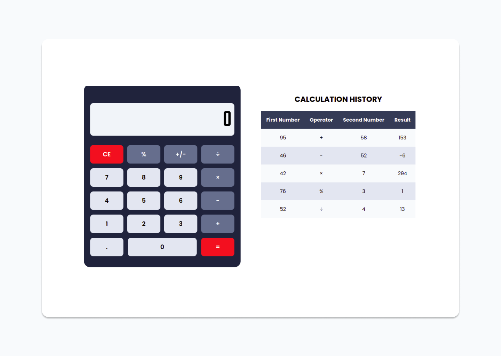

<h1 align="center">Web Calculator</h1>

<div>
  
<div>

<br>

<div align="center">
    <p>Web Calculator is a web-based application that allows us to perform simple arithmetic operations such as addition, subtraction, multiplication, and others. When we do the calculation process, the history will be saved automatically into web storage and will be displayed in tabular form.</p>
    <br>
    <a href="https://ekialfani.github.io/web-calculator/">View Demo</a>
    &nbsp;·&nbsp;
    <a href="https://github.com/ekialfani/web-calculator/issues">Report Bug</a>
</div>

<br>
<br>

## Built With
- HTML
- CSS
- JavaScript
- Web Storage

## Installation
* Clone the repo
  ```sh
  git clone https://github.com/ekialfani/web-calculator
  ```
##  Contributing
1. Fork the project
2. Create your feature branch (`git checkout -b my-new-feature`)
3. Commit to the branch (`git commit -am 'Add some feature'`)
4. Push to the branch (`git push origin my-new-feature`)
5. Create a new pull request
